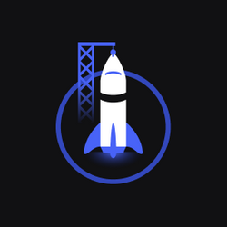

<h1>Mission: Origin</h1>
</h1>

Project by NLW - Heat, where a card was built based on the DoWhile 2021 event

<h2>Deploy:</h2>

[Github Pages](https://felipe-souza17.github.io/nlw-heat-origin/)

<h2>Challenges:</h2>

- [✔️] Desktop version
- [✔️] Change colors
- [✔️] Apply animations

#NeverStopLearning
